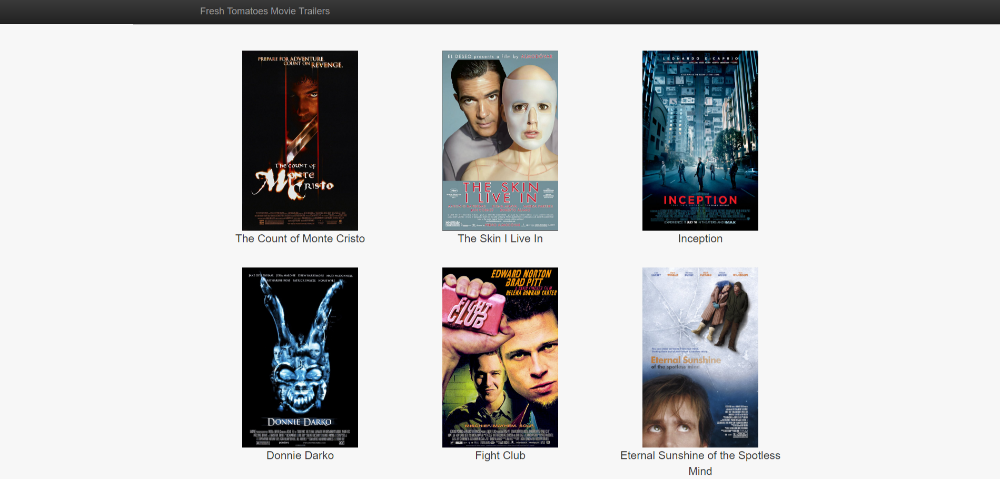
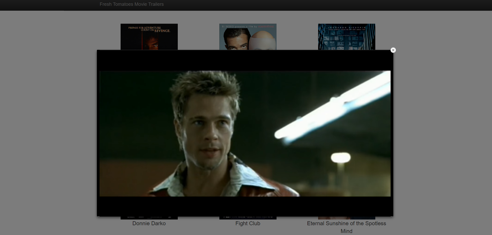
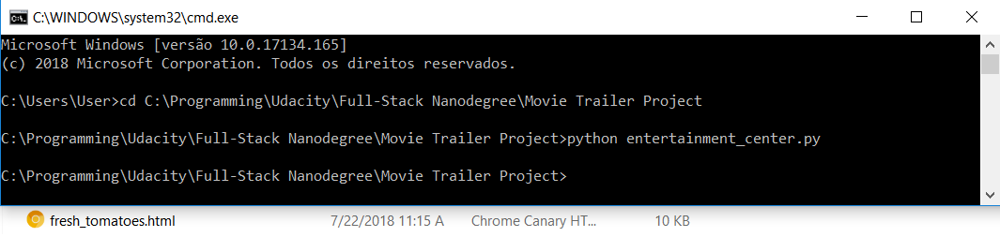

# Fresh Tomatoes

\**This project preview is available [HERE](https://edugord.github.io/Movie-Trailer-Prject/)

## Overview

Fresh tomatoes is the first project of [Udacity's Full-Stack Web Development Nanodegree](https://br.udacity.com/course/full-stack-web-developer-nanodegree--nd004?gclid=CjwKCAjw1tDaBRAMEiwA0rYbSNfv282tTxofILpC99Wtn_T2hK0e7_Kt8NNHD0OucIeCPKCMEn754BoCiiMQAvD_BwE),
the student is challenged to build a server-side code to store a list of their
favorite movies, including box art imagery and a movie trailer URL.

## Objective

The student will apply basic object-oriented Python procedures while learning
how to make the aplication serve HTML via the browser, establishing a foundation
in core programming concepts using Python and understanding the role a simple
web browser has in receiving requests, executing blocks of code and generating
responses.

The student is also encouraged to start familiarizing with [Standard Code Style (PEP8)](https://www.python.org/dev/peps/pep-0008/).

## Project Display

The Movie Trailer Website project should look like the following image:

And it responds to left mouse clicks on any movie poster opening its trailer.

## How can I open this project?

Simply download *index.html* and open it or access it [HERE](https://edugord.github.io/Movie-Trailer-Prject/).

## How can I compile this project myself?

[Python 3.6](https://www.python.org/downloads/release/python-360/) was used to build this project in its entirety.

Simply run entertainment_center.py through Python in the command line of your operating system to build this project, it will generate a HTML file named *fresh_tomatoes.html* containing the movies showcase website.

Example:

